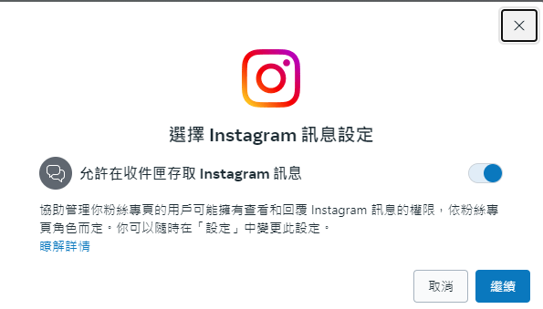

# Guide on how to create a Instagram business account and link to Meta Fanpage
**2024 Jun. 24**

Once you create an Instagram business account, it's important to link it to your Meta Fanpage so that the two social media platforms can be operated under Octopi Meta App.

## Perequisite
This tutorial assumes that you have an active Meta Fanpage, let's say **My Pseudo Café.** 

## Step 1: Create an Instagram business account

#### 1-1. On Instagram, [sign up](https://www.instagram.com/accounts/emailsignup/) to create a new account.
Siging up with email address is preferred.

#### 1-2. On task bar >> More >> Settings >> Account Type & Tool, select switch to business account
This is important as Instagram allows only business account to be operated with the same Meta Business-type App.

Then select **Business** and click **Next Step** 

## Step 2: Link Meta Fanpage to Instagram business account through Meta Business Suite

#### 2-1. On [Meta Business Suite](https://business.facebook.com/), go to My Psuedo Café's profile, select Instagram icon to prompt linking

Then click **Login to Instagram**:

Then click **Continue** to allow acess to to Instagram message

Then click **Continue**:

#### Congrats, now you have linked Instagram Business Account of My Pseudo Café with Meta Fanpage
